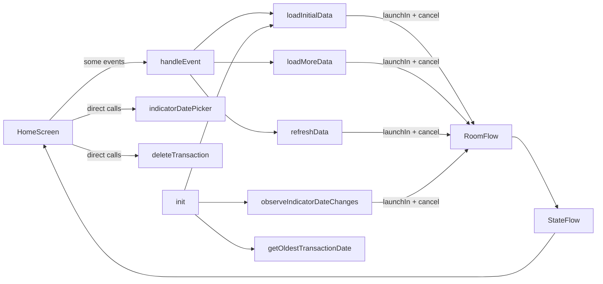
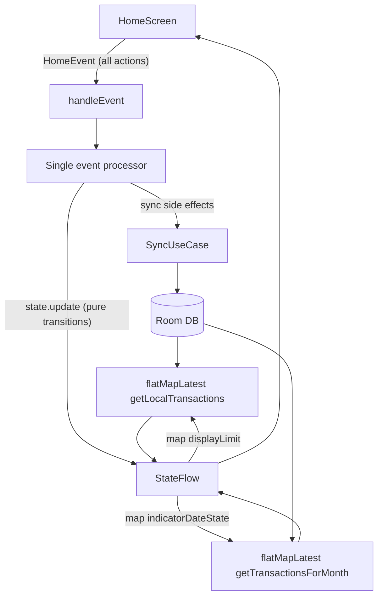

# Refactor HomeScreenViewModel to Unidirectional Transaction Fetching

## Current state (what breaks UDF)

`[HomeScreenViewModel.kt](composeApp/src/commonMain/kotlin/com/banko/app/ui/screens/home/HomeScreenViewModel.kt)` is **partially** unidirectional: `LoadMore`, `Refresh`, and `ErrorShown` go through `handleEvent`, but `indicatorDatePicker()` and `deleteTransaction()` bypass it. Transaction data is fetched through **four imperative paths** that manually launch/cancel Room `Flow` jobs via `activeFlowJobs`:




Additional issues to fix during the refactor:

- **Side state outside `StateFlow`**: `currentPage` and `activeFlowJobs` are mutable vars, not observable state.
- **Duplicate monthly subscription**: `loadInitialData()` and `observeIndicatorDateChanges()` both subscribe to `getTransactionsForMonth`.
- **Repeated `Result` handling**: identical `when (result)` blocks in three methods (~120 lines).
- **Loading bug**: if the DB already has rows (`totalTransactionCount != 0`), `loadInitialData()` never sets `isLoading = false`.

---

## Target architecture

Adopt a **lightweight UDF** pattern consistent with the rest of Banko (no new MVI library). The canonical loop:




**Rules:**

1. UI only reads `state` and sends `HomeEvent` — no direct ViewModel method calls.
2. ViewModel only mutates state via `_state.update { ... }` (or a small `reduce()` helper).
3. Room `Flow`s are **reactive subscriptions** keyed off state fields — no manual `Job` list.
4. Network sync is **event-driven** (`ScreenStarted`, `LoadMore`, `Refresh`) and writes to Room; UI updates follow automatically from Room.

---

## Step 1 — Unify events and state

**File:** `[HomeScreenState.kt](composeApp/src/commonMain/kotlin/com/banko/app/ui/screens/home/HomeScreenState.kt)`

Rename `TransactionsEvent` → `HomeEvent` and cover every user/system action:

```kotlin
sealed interface HomeEvent {
    data object ScreenStarted : HomeEvent
    data object LoadMore : HomeEvent
    data object Refresh : HomeEvent
    data class IndicatorDateChanged(val date: LocalDateTime) : HomeEvent
    data class DeleteTransaction(val id: String) : HomeEvent
    data class ErrorShown(val message: String) : HomeEvent
}
```

Move pagination into state (remove `currentPage` var from ViewModel):

```kotlin
data class HomeScreenState(
    // ...existing fields...
    val displayLimit: Int = 30,          // replaces offset-based currentPage logic
    val currentPage: Int = 0,            // for API page tracking
)
```

Keep `isLoading` / `isRefreshing` as-is (already consumed by `[HomeScreen.kt](composeApp/src/commonMain/kotlin/com/banko/app/ui/screens/home/HomeScreen.kt)`); optionally consolidate later into a `FetchStatus` sealed class.

---

## Step 2 — Replace manual Flow jobs with reactive collectors

**File:** `[HomeScreenViewModel.kt](composeApp/src/commonMain/kotlin/com/banko/app/ui/screens/home/HomeScreenViewModel.kt)`

Delete `activeFlowJobs`, `loadLocalTransactions()`, and the monthly subscription inside `loadInitialData()`. Replace with two `init` collectors:

```kotlin
// Main transaction list — re-subscribes automatically when displayLimit changes
viewModelScope.launch {
    state.map { it.displayLimit }
        .distinctUntilChanged()
        .flatMapLatest { limit -> repository.getLocalTransactions(limit) }
        .collect { transactions ->
            _state.update {
                it.copy(
                    transactions = transactions,
                    endReached = transactions.size < it.displayLimit,
                    isLoading = false,
                    isRefreshing = false,
                )
            }
        }
}

// Monthly indicator — re-subscribes when picker date changes
viewModelScope.launch {
    state.map { it.indicatorDateState }
        .distinctUntilChanged()
        .flatMapLatest { date -> repository.getTransactionsForMonth(date, date.year) }
        .collect { monthly ->
            _state.update { it.copy(monthlyTransactions = monthly) }
        }
}
```

This eliminates `observeIndicatorDateChanges()` and all `activeFlowJobs.forEach { it.cancel() }` calls. `flatMapLatest` cancels the previous Room subscription automatically when `displayLimit` or `indicatorDateState` changes.

---

## Step 3 — Single event processor for sync side effects

Replace scattered `loadInitialData` / `loadMoreData` / `refreshData` with one entry point:

```kotlin
fun handleEvent(event: HomeEvent) {
    viewModelScope.launch { processEvent(event) }
}

private suspend fun processEvent(event: HomeEvent) {
    when (event) {
        HomeEvent.ScreenStarted -> onScreenStarted()
        HomeEvent.LoadMore -> onLoadMore()
        HomeEvent.Refresh -> onRefresh()
        is HomeEvent.IndicatorDateChanged ->
            _state.update { it.copy(indicatorDateState = event.date) }
        is HomeEvent.DeleteTransaction -> onDelete(event.id)
        is HomeEvent.ErrorShown -> clearError(event.message)
    }
}
```

Dispatch `ScreenStarted` once from `init { handleEvent(HomeEvent.ScreenStarted) }` instead of calling three private init methods.

`**onScreenStarted()**` (replaces `loadInitialData` + `getOldestTransactionDate`):

- Set `isLoading = true`
- Load `oldestTransactionDate` from repository
- If DB is empty, call sync for page 1; otherwise just clear loading (Room Flow will populate list)

`**onLoadMore()**` (replaces `loadMoreData`):

- Guard: return if `isLoading || endReached`
- If remote pages remain (`storedCount < totalTransactionCount`), fetch next API page via sync use case
- On success, increment `displayLimit` and `currentPage` in state — the reactive collector picks up the wider query automatically
- If all remote data is local but list is shorter than stored count, increment `displayLimit` only
- If nothing left, set `endReached = true`

`**onRefresh()**` (replaces `refreshData`):

- Set `isRefreshing = true`
- Sync page 1 from API
- Reset `displayLimit = pageSize`, `currentPage = 1`, `endReached = false`
- Room Flow emits updated list; collector clears `isRefreshing`

---

## Step 4 — Extract sync logic into a use case

**New file:** `composeApp/src/commonMain/kotlin/com/banko/app/domain/SyncTransactionsUseCase.kt`

Mirror existing use cases (`[DeleteTransactionUseCase.kt](composeApp/src/commonMain/kotlin/com/banko/app/domain/DeleteTransactionUseCase.kt)`):

```kotlin
class SyncTransactionsUseCase(
    private val repository: DatabaseTransactionRepository,
) {
    suspend operator fun invoke(pageNumber: Int, pageSize: Int): Result<Long> =
        repository.fetchAndStoreTransactions(pageNumber, pageSize)

    suspend fun storedCount(): Long = repository.getStoredTransactionCount()
}
```

Wire in `[Modules.kt](composeApp/src/commonMain/kotlin/com/banko/app/di/Modules.kt)` with `singleOf(::SyncTransactionsUseCase)`.

Add a private helper in the ViewModel to collapse repeated error mapping:

```kotlin
private fun HomeScreenState.withFetchError(result: Result.Error): HomeScreenState = ...
```

---

## Step 5 — Update UI to be fully event-driven

**File:** `[HomeScreen.kt](composeApp/src/commonMain/kotlin/com/banko/app/ui/screens/home/HomeScreen.kt)`

Route remaining direct calls through `handleEvent`:


| Current call                        | Replace with                                      |
| ----------------------------------- | ------------------------------------------------- |
| `viewModel.indicatorDatePicker(it)` | `handleEvent(HomeEvent.IndicatorDateChanged(it))` |
| `viewModel.deleteTransaction(it)`   | `handleEvent(HomeEvent.DeleteTransaction(it))`    |


No changes needed to the stateless `HomeScreen(state, ...)` composable — it already receives lambdas.

---

## What stays the same

- **Local-first strategy**: Room remains the UI source of truth; API is sync-only. No changes to `[TransactionsRepository.kt](composeApp/src/commonMain/kotlin/com/banko/app/database/repository/TransactionsRepository.kt)` unless you want to fix the dead-code line at L91 (`Result.Success(result.value.totalCount <= ...)`) while you're in there.
- **Delete flow**: still delegates to `DeleteTransactionUseCase`; Room Flow auto-updates the list after local delete.
- **Navigation**: `HomeComponent` / `HomeEvent.kt` (Decompose navigation) stays separate from ViewModel events.

---

## Resulting ViewModel shape (~150 lines vs ~375)


| Concern           | Before                            | After                                     |
| ----------------- | --------------------------------- | ----------------------------------------- |
| Entry points      | 3 methods + partial `handleEvent` | Single `handleEvent`                      |
| Flow management   | Manual `Job` list + cancel        | `flatMapLatest` on state fields           |
| Pagination state  | `var currentPage`                 | `currentPage` + `displayLimit` in state   |
| Monthly data      | 2 subscriptions                   | 1 reactive collector                      |
| API error mapping | 3 duplicated blocks               | 1 helper                                  |
| Init              | 3 side-effect methods             | `ScreenStarted` event + 2 Flow collectors |


---

## Verification

Manual test checklist after refactor:

1. Fresh install / empty DB → loading spinner → transactions appear
2. DB already populated → no stuck loading spinner (fixes existing bug)
3. Scroll to bottom → load more fetches remote page then expands local list
4. Pull-to-refresh → list resets to page 1
5. Change month in picker → circular indicator updates
6. Delete transaction → item removed from list
7. Airplane mode on refresh → error snackbar, state recovers

